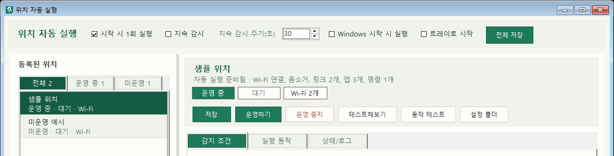

# WinZoneTrigger {#cover .cover .dark eyebrow="Windows Location Automation"}

장소에 도착하면 PC가 먼저 작업 환경을 준비하는 Windows 트레이 앱입니다.

WinZoneTrigger는 Windows 위치 좌표와 주변 Wi-Fi를 감지해서, 사용자가 특정 장소에 들어왔을 때 앱 실행, Chrome 링크 열기, 소리 설정 변경, 명령어 실행을 자동으로 처리합니다.

GitHub 저장소: [github.com/sungreong/WinZoneTrigger](https://github.com/sungreong/WinZoneTrigger)

설치 파일: [GitHub Releases](https://github.com/sungreong/WinZoneTrigger/releases/latest)에서 `WinZoneTrigger_Setup.exe` 다운로드

블로그 홍보용 원고: [BLOG_PROMOTION.md](BLOG_PROMOTION.md)

---
{: .page-break}

## 한 줄로 말하면 {: .message}

WinZoneTrigger는 Samsung Galaxy의 Modes and Routines에서 볼 수 있는 "조건이 맞으면 행동을 실행한다"는 감각을 Windows PC 작업 환경으로 가져온 프로그램입니다.

핸드폰에서는 집, 회사, 수면, 운전 같은 상황에 따라 루틴을 자동으로 켤 수 있습니다. 이 프로젝트는 그 아이디어를 바탕으로, "PC도 내가 어디에 있는지에 따라 작업 준비를 스스로 해주면 좋겠다"는 문제의식에서 출발했습니다.

---
{: .page-break}

## 만든 이유 {: .two-column}

### 장소가 바뀌면 PC에서 하는 일도 바뀝니다

집에서는 개인 노트, 개발 도구, 음악, 사이드 프로젝트 링크를 열고 싶습니다. 회사나 작업실에서는 업무 문서, 협업 도구, 필요한 앱을 먼저 띄우고 싶습니다.

### 반복 준비 작업을 줄이고 싶었습니다

매번 같은 앱을 열고, 같은 링크를 찾고, 같은 Wi-Fi에 연결하고, 소리 상태를 바꾸는 일은 작지만 계속 누적됩니다. WinZoneTrigger는 그 반복을 "장소 진입"이라는 신호 하나로 묶습니다.

---
{: .page-break}

## 화면 미리보기 {: .half-bleed side="right"}

앱은 왼쪽에서 등록된 위치를 관리하고, 오른쪽에서 감지 조건과 실행 동작을 설정하는 구조입니다.

좌표 기반 감지와 Wi-Fi 기반 감지를 함께 사용할 수 있고, 위치별로 운영 중/미운영 상태를 전환할 수 있습니다. 상태/로그 탭에서는 현재 조건 일치 여부, 보이는 Wi-Fi, 실행 기록을 확인할 수 있습니다.

---
{: .page-break}

## 핵심 기능 {: .agenda}

1. Windows 위치 서비스의 위도/경도 좌표로 특정 반경 안에 들어왔는지 확인합니다.
2. 주변에 보이는 Wi-Fi SSID를 기준으로 장소를 판단합니다.
3. 위치별로 자동 실행 여부를 켜고 끌 수 있습니다.
4. 위치 진입 시 지정한 Wi-Fi 연결을 시도할 수 있습니다.
5. Chrome 링크 여러 개를 한 번에 탭으로 엽니다.
6. 시작 메뉴 앱, 실행 파일, 바로가기, 앱 프로토콜, 고급 명령어를 실행합니다.
7. 음소거 또는 음소거 해제를 자동으로 적용합니다.
8. Windows 시작 시 트레이 앱으로 실행하고, 부팅 직후 위치를 한정 재확인합니다.

---
{: .page-break}

## 사용 장면 {: .three-column}

### 집

개인 노트 앱, Docker, 개발 폴더, 자주 쓰는 웹 링크를 자동으로 열어 개인 작업 모드로 전환합니다.

### 회사

회사 Wi-Fi가 보이면 업무 문서 링크, 협업 도구, 필요한 앱을 열고 업무 환경을 빠르게 준비합니다.

### 조용한 공간

특정 위치에서는 음소거를 켜거나, 필요한 명령어만 실행해서 환경을 조용하게 맞춥니다.

---
{: .page-break}

## 비슷한 제품과의 관계 {: .compare}

### 모바일/클라우드 자동화

Samsung Modes and Routines, Apple Shortcuts, IFTTT Location, Tasker는 위치나 상태를 조건으로 삼아 행동을 실행하는 자동화 경험을 제공합니다. 특히 Samsung Modes and Routines는 "출근하면 Wi-Fi를 켜고 알림음을 조정한다"는 식의 일상 조건 기반 자동화에 가깝습니다.

### Windows 작업 환경 자동화

Power Automate Desktop, PowerToys Workspaces, AutoHotkey는 Windows에서 강력한 자동화 수단을 제공합니다. 다만 WinZoneTrigger는 복잡한 워크플로 전체보다 "특정 장소에 들어왔을 때 PC 작업 환경을 자동 준비한다"는 좁고 실용적인 문제에 집중합니다.

---
{: .page-break}

## 포지셔닝 {: .message}

WinZoneTrigger는 모바일 루틴의 직관성을 Windows 데스크톱으로 옮긴 위치 기반 작업 준비 도구입니다.

기존 자동화 도구가 "무엇을 자동화할 수 있는가"에 더 넓게 답한다면, WinZoneTrigger는 "내가 이 장소에 도착했을 때 PC가 무엇을 먼저 해주면 좋은가"에 집중합니다. 그래서 설정 화면도 스크립트 중심이 아니라 위치, 감지 조건, 실행 동작, 상태 확인이라는 흐름으로 구성되어 있습니다.

---
{: .page-break}

## 프로그램 구조 {: .timeline}

1. 위치 등록: 좌표 또는 주변 Wi-Fi를 기준으로 장소를 만듭니다.
2. 조건 확인: 스캔 주기마다 현재 좌표와 보이는 Wi-Fi를 읽습니다.
3. 진입 판정: 밖에 있다가 해당 위치 안으로 들어온 순간을 감지합니다.
4. 동작 실행: Wi-Fi 연결, 링크 열기, 앱 실행, 소리 설정, 명령어 실행을 순서대로 처리합니다.
5. 기록 확인: 상태/로그 탭에 최근 이벤트와 전체 실행 로그를 남깁니다.

---
{: .page-break}

## 기술적 특징 {: .two-column}

### 로컬 중심

설정은 `%APPDATA%\WinZoneTrigger\config.json`에 저장됩니다. 위치 규칙, 좌표, Wi-Fi SSID, 링크, 앱 목록은 외부 서버로 전송하지 않고 현재 PC에서만 사용합니다.

### Windows 네이티브

C# Windows Forms 기반의 트레이 앱으로 구현되어 있습니다. 위치 확인은 Windows 위치 서비스를 사용하고, Wi-Fi 감지는 Windows WLAN API를 통해 주변 네트워크를 읽습니다.

---
{: .page-break}

## 이 프로젝트의 차별점 {: .agenda}

1. 장소를 중심으로 PC 작업 환경을 자동화합니다.
2. 좌표와 Wi-Fi를 함께 사용해 실내외 상황에 대응합니다.
3. 앱 실행, Chrome 링크, 음소거, 명령어 실행을 한 위치 규칙 안에 묶습니다.
4. 운영 중/미운영 전환과 테스트 기능으로 실제 자동 실행 전에 조건을 확인할 수 있습니다.
5. 시작 프로그램과 트레이 실행을 지원해 일상적으로 켜두기 쉽습니다.
6. 데이터 수집이나 원격 추적 없이 로컬 설정 파일 중심으로 동작합니다.

---
{: .page-break}

## 참고한 제품과 비교 기준 {: .table-fit}

| 제품 | 강점 | WinZoneTrigger와의 차이 |
| --- | --- | --- |
| Samsung Modes and Routines | 모바일 기기에서 조건 기반 루틴을 쉽게 구성 | WinZoneTrigger의 아이디어 출발점에 가깝지만, 대상은 Windows PC 작업 환경 |
| Apple Shortcuts | iPhone/iPad에서 개인 자동화와 앱 동작 연결 | 모바일 생태계 중심이며, Windows 장소 기반 앱 실행과는 초점이 다름 |
| IFTTT Location | 위치 트리거를 여러 서비스와 연결 | 클라우드 서비스 연결에 강하고, 로컬 PC 실행 환경과는 역할이 다름 |
| Tasker | Android에서 매우 세밀한 조건과 동작 구성 | 강력하지만 Android 중심이며, Windows 데스크톱 준비 도구는 아님 |
| Power Automate Desktop | Windows 작업 자동화와 데스크톱 플로우 구성 | 범용 자동화에 강하지만 위치 진입 UX가 핵심은 아님 |
| PowerToys Workspaces | 앱 묶음과 창 배치를 작업 공간으로 복원 | 장소 감지보다 데스크톱 레이아웃 복원에 초점 |
| AutoHotkey | 스크립트 기반 Windows 자동화 | 자유도는 높지만 위치/Wi-Fi 기반 설정 UI를 직접 구성해야 함 |

---
{: .page-break}

## 마무리 {: .dark}

WinZoneTrigger는 "내가 어디에 있는가"를 Windows PC 자동화의 시작점으로 삼습니다.

집에 도착하면 개인 작업 환경을, 회사 Wi-Fi가 보이면 업무 환경을, 조용한 공간에 들어가면 소리 설정을 자동으로 준비합니다. Samsung Galaxy의 루틴에서 얻은 위치 기반 자동화의 감각을 Windows 데스크톱에 맞게 다시 해석한 작은 도구입니다.

---
{: .page-break}

## 참고 링크

- [GitHub - WinZoneTrigger](https://github.com/sungreong/WinZoneTrigger)
- [블로그 홍보용 원고](BLOG_PROMOTION.md)
- [Samsung - Use Modes and Routines on your Galaxy phone or tablet](https://www.samsung.com/us/support/answer/ANS10002538/)
- [Apple - Intro to personal automation in Shortcuts](https://support.apple.com/guide/shortcuts/intro-to-personal-automation-apd690170742/ios)
- [IFTTT - Location integrations](https://ifttt.com/location)
- [Tasker - Location Context](https://tasker.joaoapps.com/userguide/en/loccontext.html)
- [Microsoft - Get started with Power Automate in Windows 11](https://learn.microsoft.com/en-us/power-automate/desktop-flows/getting-started-windows-11)
- [Microsoft - PowerToys Workspaces](https://learn.microsoft.com/en-us/windows/powertoys/workspaces)
- [AutoHotkey](https://ahkscript.github.io/)
