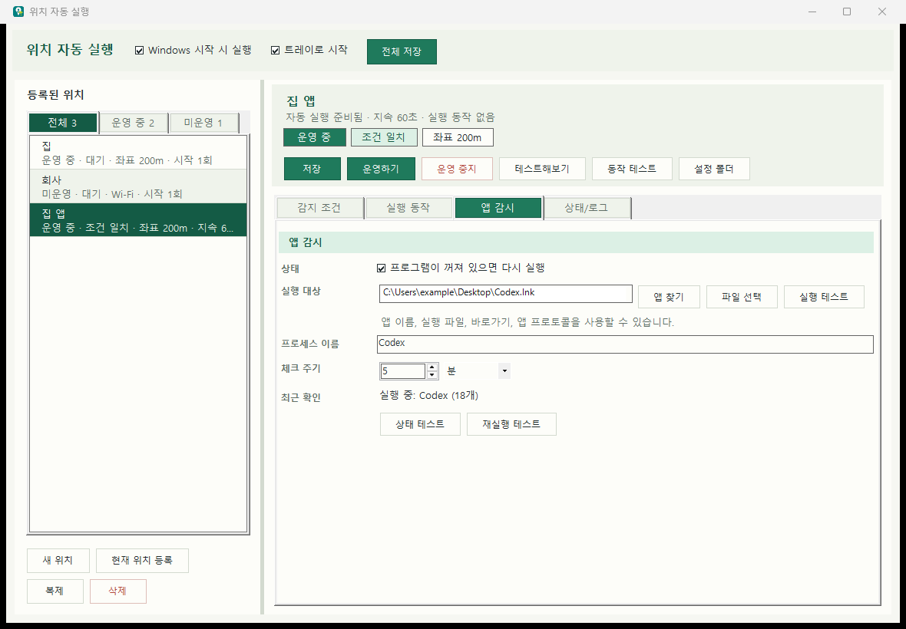

# WinZoneTrigger

Windows 위치 좌표 또는 주변 Wi-Fi를 감지해서, 특정 장소에 들어왔을 때 자동으로 앱, Chrome 링크, 소리 설정, 명령어를 실행하는 Windows 트레이 앱입니다.

예를 들어 집에 들어오면 Obsidian과 Docker를 실행하고, 회사 Wi-Fi가 보이면 업무용 문서 링크를 Chrome 탭으로 열고, 특정 장소에서는 음소거를 자동으로 켤 수 있습니다. 자주 꺼지는 앱이 여러 개 있다면 각각 다른 주기로 감시하다가 다시 켜두는 것도 가능합니다.

최신 버전: [GitHub Releases 최신 릴리스](https://github.com/sungreong/WinZoneTrigger/releases/latest)

## 화면 미리보기

아래 화면은 공개 README용 샘플 데이터로 캡처한 예시입니다. 실제 좌표, 실제 Wi-Fi 이름, 실제 링크는 포함하지 않았습니다.



## 주요 기능

- Windows 위치 서비스의 위도/경도 기반 위치 감지
- 주변 Wi-Fi SSID 기반 위치 감지
- 위치별 `운영 중` / `미운영` 전환
- 위치 진입 시 Wi-Fi 연결 시도
- 음소거 / 음소거 해제 실행
- Chrome 링크 여러 개 자동 열기
- 컴퓨터 안의 앱 검색 후 여러 앱 등록
- 실행 파일, 바로가기, 앱 이름, 프로토콜 실행 지원
- 고급 명령어를 한 줄씩 실행
- 여러 앱을 각각 다른 주기로 확인하고 다시 실행하는 앱 감시
- 앱 감시 항목별 `ON` / `OFF` 토글
- 앱 감시에서 `표시 창 필요`를 켜면 프로세스뿐 아니라 실제 표시 창까지 확인
- 위치별 `시작 시 1회 실행` / `지속 감시` 주기 설정
- 위치 복제로 비슷한 장소 규칙을 빠르게 추가
- 시작 프로그램 등록과 트레이 실행
- 상단 `화면 갱신`으로 백그라운드 상태, 실행 로그, 선택된 앱 감시 현재 상태를 수동 갱신

## 최근 업데이트

- 상단 요약 바 버튼을 목적별로 나누고 `화면 갱신`을 추가했습니다. 선택된 앱 감시 항목의 현재 상태를 팝업 없이 즉시 확인할 수 있습니다.
- `운영 중지`에는 확인창을 추가해 실수로 자동 실행과 앱 감시를 멈추는 일을 줄였습니다.
- `앱 감시` 탭에서 여러 감시 항목을 등록할 수 있게 했습니다. 각 항목은 실행 대상, 프로세스 이름, 체크 주기, `ON` / `OFF` 상태를 따로 가집니다.
- 앱 감시의 `표시 창 필요` 옵션이 실제 표시 창을 기준으로 동작합니다. Codex처럼 백그라운드 프로세스는 남아 있지만 창이 사라질 수 있는 앱을 다시 열 때 유용합니다.
- 앱 찾기 목록은 첫 검색 후 캐시를 재사용하고, `새로고침`을 누를 때만 다시 수집합니다.
- `시작 시 1회 실행`과 `지속 감시` 설정을 위치별 옵션으로 개편했습니다. 집은 부팅 때 한 번만, 회사는 60초마다 감시하는 식으로 나눠 운영할 수 있습니다.
- 시작 메뉴 앱 검색이 더 안정적으로 동작하도록 앱 ID와 바로가기 정보를 함께 활용합니다.
- 위치 `복제` 버튼을 추가해 비슷한 조건의 규칙을 빠르게 만들 수 있습니다.

Codex가 원인 모를 이슈로 조용히 퇴근해버리는 날이 있다면, Codex 바로가기를 앱 감시 대상으로 등록해두세요. 꺼져도 다시 켜서 일을 이어 맡길 수 있습니다. ㅎㅎ

## 개인정보와 데이터 수집

WinZoneTrigger는 사용자의 데이터를 외부 서버로 가져가거나 전송하지 않습니다.

- 위치 규칙, 좌표, Wi-Fi SSID, 링크, 앱 실행 목록은 로컬 설정 파일에만 저장됩니다.
- 설정 파일은 `%APPDATA%\WinZoneTrigger\config.json`에 저장됩니다.
- 앱은 광고, 분석, 원격 추적, 텔레메트리 기능을 포함하지 않습니다.
- 네트워크 요청은 사용자가 등록한 Chrome 링크를 열거나, 사용자가 등록한 앱/명령어가 자체적으로 수행하는 동작에 한정됩니다.
- Windows 위치 정보와 Wi-Fi 목록은 위치 조건 확인을 위해 현재 PC에서만 읽습니다.

## 화면 구성

앱은 왼쪽의 위치 목록과 오른쪽의 상세 설정 화면으로 나뉩니다.

왼쪽 `등록된 위치`에서는 위치를 `전체`, `운영 중`, `미운영`으로 나누어 볼 수 있습니다. 목록에는 위치 이름과 현재 상태가 함께 표시됩니다.

오른쪽 상단 요약 바에는 선택한 위치의 이름, 운영 상태, 조건 일치 여부, 감지 방식이 표시됩니다. 주요 버튼도 이곳에 모여 있습니다.

- `저장`: 현재 위치 설정을 저장합니다.
- `운영하기`: 이 위치를 자동 실행 대상으로 켭니다.
- `운영 중지`: 확인 후 이 위치를 자동 실행 대상에서 뺍니다.
- `테스트해보기`: 현재 PC 상태가 이 위치 조건과 맞는지만 확인합니다.
- `동작 테스트`: 설정된 실행 동작을 지금 한 번 실행합니다.
- `화면 갱신`: 백그라운드 상태와 실행 로그를 다시 읽고, 선택된 앱 감시 항목의 현재 상태를 재실행 없이 확인합니다.
- `설정 폴더`: 설정 JSON이 저장된 폴더를 엽니다.

상단 버튼은 `저장/화면 갱신`, `테스트`, `설정`, `운영 전환` 그룹으로 나뉩니다. `운영 중지`는 확인창에서 다시 승인해야 적용됩니다.

오른쪽 상세 영역은 네 개의 탭으로 구성됩니다.

- `감지 조건`: 위치 이름, 운영 여부, 좌표 감지, Wi-Fi 감지 조건을 설정합니다.
- `실행 동작`: Wi-Fi 연결, 소리, Chrome 링크, 앱 실행, 고급 명령어를 설정합니다.
- `앱 감시`: 특정 앱이 꺼졌는지 주기적으로 확인하고 필요하면 다시 실행합니다.
- `상태/로그`: 조건 일치 상태, 현재 좌표, 보이는 Wi-Fi, 최근 이벤트와 전체 로그를 확인합니다.

## 운영하기와 테스트의 차이

`테스트해보기`는 현재 PC가 선택한 위치 조건과 맞는지 확인만 합니다. 운영 중이 아니어도 테스트할 수 있습니다.

`운영하기`는 이 위치를 실제 자동 실행 대상으로 켭니다. 앱은 밖에 있다가 해당 위치 안으로 들어온 순간에만 동작을 실행합니다. 같은 위치 안에 계속 있는 동안에는 진입 동작을 스캔 주기마다 반복 실행하지 않습니다.

`감지 조건` 탭의 `시작 시 1회 실행`은 Windows 시작으로 앱이 켜졌을 때 해당 위치 조건을 한정 확인합니다. `지속 감시`는 지정한 초 단위 주기로 위치 조건을 계속 확인합니다. 두 옵션은 위치마다 따로 저장됩니다.

## 빠른 사용 순서

1. `새 위치` 또는 `현재 위치 등록`을 눌러 위치를 만듭니다.
2. `감지 조건` 탭에서 좌표 또는 Wi-Fi 조건을 설정합니다.
3. `실행 동작` 탭에서 실행할 앱, 링크, 소리, 명령어를 등록합니다.
4. 필요하면 `앱 감시` 탭에서 계속 살려둘 프로그램과 체크 주기를 등록합니다.
5. `테스트해보기`로 현재 조건이 맞는지 확인합니다.
6. `동작 테스트`와 `앱 감시`의 상태/재실행 테스트로 실행 동작을 확인합니다.
7. `운영하기`를 눌러 실제 자동 실행 대상으로 켭니다.
8. `전체 저장` 또는 요약 바의 `저장`을 눌러 설정을 저장합니다.

## 감지 조건 설정

### 좌표로 감지

`Windows 위치 좌표로 감지`를 켜고 `현재 좌표 사용`을 누르면 현재 Windows 위치 좌표가 입력됩니다. 반경(m)은 해당 좌표에서 어느 정도 거리까지 같은 위치로 볼지 정하는 값입니다.

좌표 기반 감지는 Windows 설정에서 위치 서비스와 데스크톱 앱 위치 접근이 켜져 있어야 합니다. 데스크톱 PC나 실내 환경에서는 정확도가 흔들릴 수 있으므로 반경을 너무 작게 잡지 않는 것이 좋습니다.

### Wi-Fi로 감지

`Wi-Fi 후보 새로고침`을 누르면 현재 보이는 Wi-Fi 목록이 칩으로 표시됩니다. 감지에 사용할 Wi-Fi를 선택하면 해당 SSID가 위치 조건으로 저장됩니다.

`위 Wi-Fi가 모두 보일 때만 감지`를 켜면 선택한 Wi-Fi가 전부 보일 때만 위치가 일치한 것으로 판단합니다. 끄면 선택한 Wi-Fi 중 하나만 보여도 일치할 수 있습니다.

## 실행 동작 설정

### Wi-Fi 연결

`위치 진입 시 특정 Wi-Fi 연결 시도`를 켜면 위치에 들어왔을 때 지정한 Wi-Fi 프로필로 연결을 시도합니다.

Wi-Fi 연결은 Windows에 이미 저장된 Wi-Fi 프로필을 대상으로 `netsh wlan connect`를 호출합니다. 처음 연결하는 네트워크라면 Windows에서 먼저 한 번 연결해서 프로필을 만들어두는 것이 좋습니다.

### Chrome 링크

Chrome 링크 입력칸에 URL을 넣고 `링크 추가`를 누르면 링크가 칩으로 등록됩니다. 긴 URL은 짧게 표시되고, 전체 주소는 마우스를 올리면 툴팁으로 확인할 수 있습니다.

등록된 링크는 위치 진입 시 각각 Chrome 탭으로 열립니다. Wi-Fi 연결 동작이 켜져 있는 위치에서는 Wi-Fi 연결 성공 후 링크를 엽니다.

### 앱 실행

`앱 찾기`를 누르면 컴퓨터에 설치된 앱과 시작 메뉴 바로가기를 검색할 수 있습니다. Ctrl 또는 Shift로 여러 앱을 선택한 뒤 한 번에 등록할 수 있습니다.

앱 실행에는 다음 값들을 등록할 수 있습니다.

- 시작 메뉴 앱 이름
- `.exe`, `.lnk`, `.bat`, `.cmd` 파일 경로
- `chatgpt://`, `obsidian://` 같은 앱 프로토콜
- `ChatGPT`, `Obsidian`, `Docker Desktop` 같은 자주 쓰는 앱 이름

등록된 앱은 칩으로 표시됩니다. 긴 경로는 파일명 중심으로 보이고, 전체 경로는 툴팁으로 확인할 수 있습니다.

### 앱 감시

`앱 감시` 탭에서는 여러 프로그램을 등록해 각각 다른 주기로 확인하고, 실행 중이 아니면 다시 실행하도록 설정할 수 있습니다.

- `새 감시`, `앱 찾기`, `파일 선택`으로 감시 항목을 추가합니다.
- 등록 목록의 `ON` / `OFF` 토글로 항목별 감시를 바로 켜고 끕니다.
- `표시 창 필요`를 켜면 프로세스가 떠 있어도 실제 표시 창이 없을 때 실행 대상을 다시 엽니다.
- `실행 대상`에는 앱 이름, 실행 파일, 바로가기, 앱 프로토콜을 넣을 수 있습니다.
- `프로세스 이름`은 감시할 Windows 프로세스 이름입니다. 실행 대상에서 자동으로 추론할 수 있고, 직접 고칠 수도 있습니다.
- `체크 주기`는 항목마다 분 또는 시간 단위로 따로 설정합니다.
- `최근 확인`에는 선택한 감시 항목의 실제 확인 시각과 다음 확인 예정 시각이 표시되고, 재실행 알림에도 실행 시각이 함께 표시됩니다.
- `상태 테스트`는 선택한 항목의 현재 프로세스와 창 상태를 확인하고, `재실행 테스트`는 꺼져 있거나 필요한 창이 없을 때 실제로 다시 실행합니다.

예를 들어 `Codex.lnk`를 실행 대상으로 넣고 프로세스 이름을 `Codex`로 지정한 뒤 `표시 창 필요`를 켜면, Codex 프로세스는 남아 있지만 창이 없는 상태도 감지해 다시 열 수 있습니다. 맡겨둔 일이 중간에 끊기는 날을 조금 줄여주는 작은 안전벨트입니다.

### 고급 명령어

고급 명령어는 위치에 진입했을 때 위에서 아래로 한 줄씩 실행됩니다. 각 줄은 `cmd.exe /c`로 실행됩니다.

예시:

```text
notepad.exe
explorer.exe C:\Users
start "" "C:\path\file.txt"
powershell -NoProfile -Command "Write-Output hello"
```

경로에 공백이 있으면 따옴표로 감싸주세요. 일반적인 앱 실행이나 링크 열기는 고급 명령어보다 전용 UI를 사용하는 것이 좋습니다.

## Windows 시작 시 실행

`Windows 시작 시 실행`을 켜고 저장하면 현재 사용자 로그온 시 앱이 실행되도록 등록됩니다. 앱은 먼저 작업 스케줄러 등록을 시도하고, 권한 문제로 막히면 현재 사용자 `Run` 레지스트리로 자동 대체합니다.

각 위치의 `시작 시 1회 실행`을 켜면 Windows 시작으로 실행된 경우 현재 위치에 맞는 규칙을 한 번 확인합니다. 부팅 직후 Wi-Fi나 위치 서비스가 아직 준비되지 않을 수 있어서, 앱은 15초 간격으로 최대 8회까지만 한정 재확인하고 활성 위치가 인식되면 즉시 멈춥니다.

각 위치의 `지속 감시`를 켜면 지정한 초 단위 주기로 위치 조건을 계속 확인합니다. 앱 감시는 위치 조건 스캔과 별도로 분 또는 시간 단위 체크 주기를 사용합니다.

`트레이로 시작`을 켜면 Windows 시작 시 창을 띄우지 않고 트레이에서 실행됩니다. 창을 닫아도 앱은 트레이에 남아 계속 동작합니다. 완전히 종료하려면 트레이 아이콘 메뉴에서 종료를 선택하세요.

## 동작 구조

WinZoneTrigger는 자동 실행을 맡는 백그라운드 프로세스와 설정을 보여주는 화면을 분리해서 동작합니다.

- Windows 시작이나 `트레이로 시작`처럼 창 없이 실행되는 경우에는 백그라운드 자동화 컨텍스트가 위치 조건 확인, 진입 동작 실행, 앱 감시를 계속 처리합니다.
- 설정 화면은 사용자가 규칙을 보고 수정하기 위한 UI입니다. 화면이 떠 있지 않아도 백그라운드 프로세스가 살아 있으면 운영 중인 위치와 앱 감시는 계속 동작합니다.
- 두 프로세스는 각각 단일 인스턴스 잠금을 사용합니다. 백그라운드 자동화와 설정 화면을 분리해두면 설정 화면을 열고 닫는 일이 자동 실행 루프를 끊지 않습니다.
- 백그라운드 프로세스는 현재 조건 일치, 위치/Wi-Fi 상태, 최근 동작, 최근 앱 감시 결과를 `%APPDATA%\WinZoneTrigger\automation-state.json`에 저장합니다.
- 실행 이벤트와 오류는 `%APPDATA%\WinZoneTrigger\activity.log`에 기록됩니다.
- `상태/로그` 탭은 이 상태 파일과 로그 파일을 주기적으로 읽어서 화면에 표시합니다. 그래서 실제 감시가 실행된 시각과 화면에 반영되는 시각이 잠깐 다를 수 있습니다.
- 화면 표시가 늦어 보이면 상단 요약 바의 `화면 갱신`을 누르면 됩니다. 이 버튼은 자동 갱신 타이머를 기다리지 않고 백그라운드 상태와 로그를 다시 읽은 뒤, 선택된 앱 감시 항목의 현재 상태를 재실행 없이 확인합니다.

이 구조는 자동화 안정성을 우선하기 위한 선택입니다. 사용자가 설정 화면을 닫거나 다시 열어도 위치 감시와 앱 감시가 중간에 멈추지 않고, 문제가 생겼을 때는 로컬 상태 파일과 로그로 어떤 일이 있었는지 확인할 수 있습니다.

## 설치

최신 설치 파일은 GitHub Releases에서 받을 수 있습니다.

- 다운로드: [WinZoneTrigger Releases](https://github.com/sungreong/WinZoneTrigger/releases/latest)
- 파일명: `WinZoneTrigger_Setup.exe`

`WinZoneTrigger_Setup.exe`를 실행하면 현재 사용자 계정에 앱이 설치되고, 시작 메뉴 바로가기, Windows 시작 시 자동 실행, Windows 앱 제거 항목이 등록됩니다.

저장소를 직접 빌드한 경우 설치 파일은 아래 위치에 만들어집니다.

```text
dist\WinZoneTrigger_Setup.exe
```

설치 위치:

```text
%LOCALAPPDATA%\Programs\WinZoneTrigger
```

제거:

```powershell
.\uninstall.ps1
```

## 빌드

앱 실행 파일 빌드:

```powershell
.\build.ps1
```

결과:

```text
bin\WinZoneTrigger.exe
```

설치 파일 빌드:

```powershell
.\build-installer.ps1
```

결과:

```text
dist\WinZoneTrigger_Setup.exe
```

## 설정 파일

설정은 아래 경로에 저장됩니다.

```text
%APPDATA%\WinZoneTrigger\config.json
```

문제가 생겼을 때는 앱의 `상태/로그` 탭에서 최근 이벤트와 전체 로그를 먼저 확인하세요.

## 라이선스

이 프로젝트는 MIT License로 배포됩니다. 자세한 내용은 [LICENSE](LICENSE)를 확인하세요.
