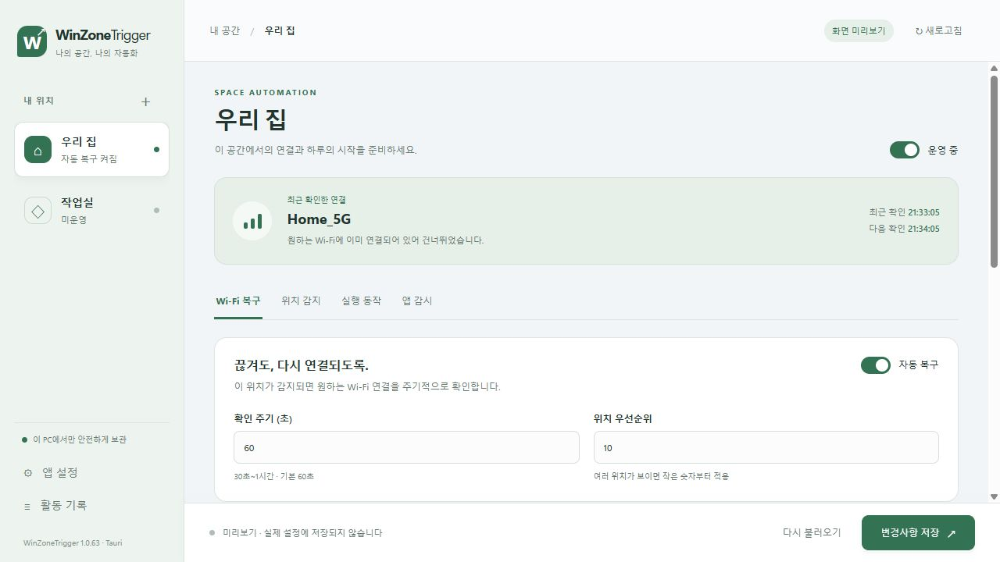
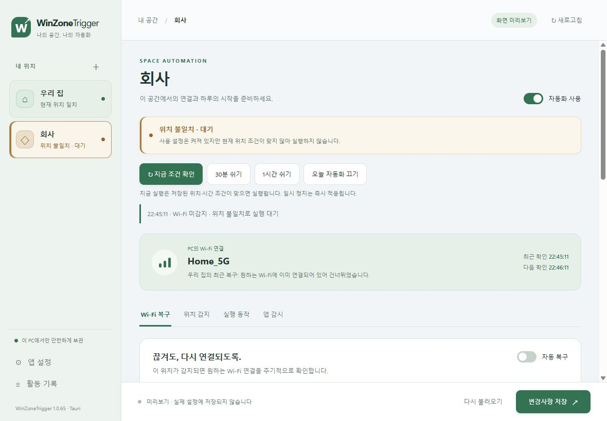

# WinZoneTrigger

장소에 맞는 Wi-Fi와 앱을 준비하는 Windows 자동화 앱입니다. **v1.0.63부터 Tauri 2 / Rust 기반 데스크톱 화면**을 사용합니다. 기존 C# 자동화 엔진을 함께 배포하므로 위치 감지, 앱 감시, 밝기 일정과 기존 설정을 이어서 사용할 수 있습니다.

[최신 설치 파일](https://github.com/sungreong/WinZoneTrigger/releases/latest) · `WinZoneTrigger_Setup.exe`



## Wi-Fi 자동 복구

1. 왼쪽에서 위치를 선택하거나 `＋`로 만듭니다.
2. **위치 감지**에서 주변 Wi-Fi 또는 좌표 조건을 설정합니다.
3. **Wi-Fi 복구 → 주변 Wi-Fi 찾기**에서 연결할 네트워크를 선택합니다.
4. **자동 복구**와 위치의 **자동화 사용**을 켜고 확인 주기를 정합니다.
5. **변경사항 저장**을 누릅니다.

기본 확인 주기는 60초이며 30~3600초로 설정할 수 있습니다. 배치는 5초 타이머에서 작업 가능 여부를 확인하고, 주변 신호는 최대 30초 간격으로 새로 읽습니다. 다른 작업 중이거나 절전 상태라면 실제 확인은 늦어질 수 있습니다.

- 이미 원하는 SSID에 연결되어 있으면 연결 명령을 보내지 않습니다.
- v1.0.66부터 자동 복구가 켜져 있고 실행 시간 조건이 맞으면, Windows에서 꺼진 Wi-Fi 소프트웨어 전원을 먼저 켭니다. 다음 확인(약 30초 뒤)에서 주변 네트워크를 새로 검색한 뒤 위치·대상 조건이 맞으면 연결합니다. 전원 요청만으로 연결 성공을 표시하지 않습니다.
- Wi-Fi를 계속 꺼두려면 **자동 복구**를 끄거나 **30분 쉬기 / 1시간 쉬기**를 사용하세요. 하드웨어 스위치로 꺼진 장치, 사용 중지된 어댑터, 권한·드라이버 오류는 별도 안내로 표시합니다. 이 경우 Windows에서 장치 상태를 확인해야 합니다.
- 위치 조건이 맞고 연결 대상이 주변에 보일 때만 Windows의 저장된 프로필로 연결합니다.
- 여러 위치가 감지되면 작은 우선순위 숫자를 우선합니다. 동순위에서는 현재 연결을 유지하고, 그 다음에는 위치 ID로 결정합니다.
- 연결 실패 시 재시도 간격을 2배씩 늘립니다. 최대 16배, 최대 1시간이며 성공하면 기본 주기로 돌아갑니다.
- 복구 작업은 앱·링크·명령어를 다시 실행하지 않습니다.
- 위치 미운영 또는 자동화 임시 정지 중에는 복구하지 않습니다.
- 처음 쓰는 Wi-Fi는 Windows에서 먼저 연결해 프로필을 저장해야 합니다. 앱은 비밀번호를 저장하지 않습니다.
- Windows의 인터넷 연결 판정을 함께 표시합니다. Wi-Fi 연결 없음과 Wi-Fi 연결 중 인터넷 없음으로 구분하며 마지막 복구 시각을 기록합니다. VPN·유선 연결이 있으면 PC 전체 판정과 Wi-Fi 회선 상태가 다를 수 있습니다. 인터넷 장애만으로 재연결하지 않습니다.

기존 위치에는 자동 복구가 기본으로 꺼져 있습니다. 원하는 위치와 연결 대상을 확인한 뒤 켜주세요.

## 화면과 기능



**자동화 사용**은 설정의 켜짐 여부이며, 왼쪽 위치 목록과 상단 상태 안내는 최근 감지 결과를 보여줍니다. v1.0.65부터 모두 `운영 중`으로 보이던 상태를 아래처럼 구분합니다.

| 상태 | 색과 의미 |
| --- | --- |
| 현재 위치 일치 | 녹색 · 위치와 시간 조건이 맞음 |
| 위치 불일치 · 대기 | 연한 주황색 · 켜져 있지만 현재 위치에서는 실행하지 않음 |
| 시간 조건 · 대기 / 일시 정지 | 연한 주황색 · 실행 시간 밖이거나 잠시 멈춤 |
| 사용 안 함 / 확인 필요 | 회색 · 꺼져 있거나 최근 판정이 없어 확인 필요 |

선택한 위치에는 상태색 테두리와 옅은 그림자를 표시합니다. 감지 실패나 오래된 결과를 현재 위치 일치로 표시하지 않습니다. **지금 조건 확인**은 저장된 조건을 새로 검사하며, 조건이 맞으면 등록된 진입 동작을 실행할 수 있습니다. Wi-Fi 연결 카드는 PC의 연결 상태이며 다른 위치에서 수행한 복구에는 해당 위치 이름을 붙입니다.

| 화면 | 할 수 있는 일 |
| --- | --- |
| Wi-Fi 복구 | 연결 대상 선택, 주기·우선순위 설정, 진입 시 연결 |
| 위치 감지 | 위치 이름, SSID 조건, 좌표·반경, 시작 실행·지속 감시 |
| 실행 동작 | 소리, 앱, Chrome 링크, 고급 명령어 |
| 앱 감시 | 여러 앱의 개별 주기와 표시 창 조건 설정 |
| 앱 설정 | 자동 시작, 트레이 시작, 절전 방지, 임시 정지, 밝기 일정 |
| 활동 기록 | 최근 연결·실행 결과와 로그 |

좁은 창에서는 위치 목록이 상단으로 이동하며, 하단 저장 버튼은 편집 영역과 분리되어 입력칸을 가리지 않습니다. `Ctrl+S`로 저장할 수 있습니다. `새로고침`은 상태만 갱신하고 편집 내용은 유지합니다. `다시 불러오기`는 디스크의 설정을 다시 읽습니다.

좌표와 Wi-Fi 감지를 함께 켜면 **둘 중 하나가 일치할 때** 위치로 판단합니다. 진입 동작은 위치에 들어왔을 때 실행되며, 이미 해당 위치에 있는 동안에는 반복하지 않습니다. 단순 설정 저장으로 진입 상태를 초기화하지 않습니다.

밝기 일정의 시간·밝기·야간 모드는 **앱 설정**에서 바로 추가·편집·삭제할 수 있습니다. 이전 화면은 **앱 설정 → 기존 고급 설정 열기**로 열 수 있습니다. 두 화면에서 편집했다면 새 화면의 `다시 불러오기`로 최신 설정을 가져오세요. [기존 고급 설정 참고](docs/LEGACY_UI.md)

창의 닫기 버튼은 트레이로 숨깁니다. 트레이의 `화면 앱 종료 (자동화 유지)`를 선택해도 자동화 엔진은 계속 실행됩니다. 상단의 `30분 쉬기`, `1시간 쉬기`, `오늘 자동화 끄기`는 즉시 적용됩니다. 오늘 끄기는 다음 날 자정에 끝나며 `자동화 재개`로 바로 해제할 수 있습니다. 편집 중인 다른 설정은 저장하거나 버리지 않습니다.

## 소리·시간 조건과 빠른 실행 (v1.0.64)


- **실행 동작 → 소리 설정 → 볼륨 지정**에서 0~100%를 지정합니다. 볼륨 지정은 음소거도 해제합니다.
- **위치 이탈·시간 종료 시 이전 소리로 복원**을 켜면 진입 전 볼륨과 음소거 상태를 기억합니다. 일시 정지·위치 비활성·삭제도 복원 조건입니다. 짧은 감지 흔들림은 최소 30초 동안 이탈을 보류합니다.
- 직접 소리나 밝기를 바꾸면 이전 값으로 덮어쓰지 않습니다. **앱 설정 → 내 조작 먼저**에서 자동화 보류 시간을 1~1440분으로 정하며 기본은 60분입니다. 다른 앱의 변경과 오디오 장치 교체도 외부 변경으로 취급합니다. 소리는 약 5초, 밝기는 약 60초 간격으로 확인하며 다른 자동 작업 중에는 늦어질 수 있습니다.
- 소리 보류 시간이 끝나면 다음 진입/수동 실행에서 적용합니다. 밝기는 다음 일정 확인에서 적용합니다. 자동화가 값을 적용하기 전의 수동 변경은 감지 대상이 아닙니다.
- **위치 감지 → 언제 실행할까요?**에서 요일과 시간을 제한합니다. 진입 동작·Wi-Fi 복구·앱 감시에 공통 적용합니다. 금요일 22:00~07:00은 토요일 오전까지 이어지고, 시작과 종료가 같으면 선택한 요일의 하루 전체입니다. 시간 시작에도 진입 동작을 실행하려면 지속 감시를 켜세요.
- **지금 실행**은 저장된 선택 위치의 현재 조건과 시간을 새로 확인한 뒤 진입 동작을 요청합니다. 미저장 편집은 실행하지 않으며 일시 정지를 우회하지 않습니다. 요청은 2분 뒤 만료됩니다.
- 위치별 실행·미실행 이유는 상단과 **활동 기록**에 표시됩니다.
- **밝기 일정을 끄면 이전 밝기로 복원**은 현재 엔진 실행 중 기록한 내장 화면 밝기를 복원합니다. 직접 변경했거나 화면이 바뀌면 복원하지 않습니다. 야간 모드는 복원하지 않습니다.

새 볼륨·복원·시간 제한 옵션은 기존 위치에 자동으로 켜지지 않습니다. 수동 변경 존중은 기본으로 켜집니다.

## 안정성 개선

- 상태 파일의 읽기·쓰기 충돌에 대응해 원자적 교체, 파일 공유 읽기, 짧은 재시도를 적용했습니다.
- 설정 저장 전 파일 변경 여부를 검사해 다른 화면에서 바뀐 설정을 덮어쓰지 않도록 했습니다.
- 정상 위치 판정·앱 감시 반복 로그는 5분 간격으로 줄이고, 진입·이탈·실패·앱 재실행은 즉시 기록합니다.
- 지원되는 사용자 Run 등록을 작업 스케줄러로 매번 이전하려던 동작을 제거했습니다.
- SSID 비교는 대소문자를 구분합니다.

## 설치와 데이터

`WinZoneTrigger_Setup.exe`는 Tauri NSIS 설치 프로그램입니다. Windows x64와 WebView2 런타임을 사용하며, 필요한 경우 설치 프로그램이 Microsoft의 런타임을 내려받습니다. 사용자 계정 단위로 설치하고 자동 시작을 등록합니다. 앱 설정에서 해제할 수 있습니다.

기존 설정과 로그는 `%APPDATA%\WinZoneTrigger`에서 계속 사용합니다.

v1.0.65는 구형 설치에서 제거가 성공해도 `제거할 수 없습니다!`가 뜨던 설치 오류를 수정했습니다. 기존 C# 설치 프로그램의 정확한 설치 경로·제거 명령이 확인되면 같은 폴더에서 교체하여 구형 제거기의 지연 폴더 삭제를 피합니다. 다른 제거기의 실제 실패는 계속 오류로 처리합니다.

| 파일 | 용도 |
| --- | --- |
| `config.json` | 위치·동작·복구 설정 |
| `config.json.bak` | 직전 저장 설정 |
| `automation-state.json` | 자동화 상태와 최근 이벤트 |
| `wifi-state.json` | Wi-Fi 복구·인터넷 상태와 다음 확인 시각 |
| `audio-state.json` | 소리 복원 기준과 수동 변경 보류 상태 |
| `decisions.json` | 위치별 최근 실행·미실행 이유 |
| `activity.log`, `errors.log` | 실행 이력과 오류 |

위치, SSID, 설정과 로그를 외부 서버로 보내지 않습니다. 앱·링크·명령어 실행으로 발생하는 통신은 사용자가 설정한 동작에 따릅니다. 설치 프로그램의 WebView2 다운로드는 초기 설치에 필요할 수 있습니다.

Windows 앱 제거에서 제거하거나 `uninstall.ps1`을 사용하세요. 설정과 로그는 보존됩니다.

## 빌드

Windows에서 Rust MSVC 도구 체인, Visual Studio C++ 빌드 도구, Node.js/npm, .NET Framework C# 컴파일러가 필요합니다.

```powershell
.\build-installer.ps1
```

이 명령은 C# 엔진을 빌드하고 Tauri 앱과 NSIS 설치 파일을 만듭니다. 처음 실행할 때 프로젝트의 npm 의존성과 Rust crate를 내려받습니다.

- `bin/WinZoneTrigger.exe` — Tauri 데스크톱 앱
- `bin/WinZoneTrigger.Engine.exe` — 자동화 엔진과 기존 고급 설정 화면
- `dist/WinZoneTrigger_Setup.exe` — 배포용 설치 파일

직접 실행할 때 두 실행 파일을 같은 폴더에 두세요. 엔진만 다시 빌드하려면 `build.ps1`을 사용합니다. Tauri 개발 실행은 엔진 빌드 후 `npm run tauri -- dev`입니다.

## 검증

```powershell
npm test
.\build.ps1
python tests/engine_integration.py
Start-Process .\bin\WinZoneTrigger.Engine.exe --logic-self-test -Wait -WindowStyle Hidden
Get-Content .\bin\logic-test-result.txt
# 설치 파일 빌드 후 실제 Tauri 실행 파일 검사
python tests/package_check.py
python tests/installer_upgrade.py
```

정책 테스트는 야간/요일 경계, 소리 복원·겹친 위치·수동 변경·장치 교체·보류 만료, 연결된 SSID 건너뛰기, 위치 조건, 우선순위, 재시도 간격을 검사합니다. 상태 파일은 200회 쓰기·500회 읽기 동시 접근을 검사합니다. 통합 테스트는 임시 폴더에서 설정 왕복 저장, 기존 날짜 형식, 동시 수정 거부, 백업과 손상 파일 처리를 검사합니다. 패키지 검사는 자동화를 시작하지 않고 실제 Tauri 실행 파일에서 Rust와 엔진 연동을 확인합니다.

화면 미리보기는 `desktop` 폴더를 로컬 정적 서버로 제공하고 `/?demo`를 열면 됩니다. 공개 스크린샷은 샘플 데이터만 사용합니다. 테스트를 위해 실제 Wi-Fi를 강제로 끊지는 않습니다.

설치 회귀 검사는 임시 레지스트리 키로 이전 설치 경로 복원, 구형 설치 식별, 제거 성공·실패 처리를 검사합니다. 실제 사용자 설치를 제거하지 않습니다. NSIS 템플릿은 Tauri CLI 2.12.0의 공식 템플릿을 기준으로 하며, 업그레이드 관련 변경은 `installer-upgrade.nsh`에 분리되어 있습니다.

Wi-Fi 전원 복구 검사는 가짜 무선 장치로 전원 꺼짐→켜기 요청→다음 배치의 위치 확인, 이미 켜진 상태 건너뛰기, 일시 정지·시간 조건·설정 변경, 하드웨어 차단과 요청 실패를 검사합니다. 전원 제어에는 [Windows WLAN API](https://learn.microsoft.com/en-us/windows/win32/api/wlanapi/nf-wlanapi-wlansetinterface)를 사용합니다.

## 구조

- `desktop/`: 로컬 HTML/CSS/JavaScript 화면
- `src-tauri/`: Rust 명령, 트레이, 단일 인스턴스, NSIS 패키징
- `src/`: 기존 C# 자동화 엔진과 고급 설정 UI
- `tests/`: UI 모델·설정·패키지 회귀 검사

Tauri 구현은 [공식 Windows 설치 문서](https://v2.tauri.app/distribute/windows-installer/)와 [Rust 명령 호출 문서](https://v2.tauri.app/develop/calling-rust/)를 따릅니다.

라이선스: [MIT](LICENSE)
